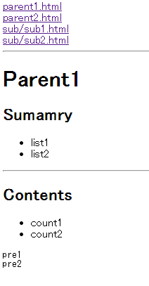

# Markun

Markun is Markdown bulk converter with menu link

## Purpose
* Markun convert all Markdown-files to html-files with menu link.

(If you do not want to create menu link, set Markunfile's have_menu to 'false'.)

* Target is All of the '*.md'files and subdirectories.

## Installation

Add this line to your application's Gemfile:

    gem 'markun'

And then execute:

    $ bundle

Or install it yourself as:

    $ gem install markun

## Structure
### before convert
~~~
.
┗ Target
    ┠ Markunfile :dsl setting file
    ┠ some1.md
    ┠ some2.md
    ┗  sub
      sub1.md
      sub2.md
~~~

### after convert
~~~
.
┗ Target
    ┠ Markunfile :dsl setting file
    ┠ some1.md
    ┠ some1.html
    ┠ some2.md
    ┠ some2.html
    ┗  sub
        ┠ sub1.md
        ┠ sub1.html
        ┠ sub2.md
        ┗ sub2.html
~~~

## Usage
### Before Structure
~~~bash
$ tree
.
┠ parent1.md
┠ parent2.md
┗ sub
    ┠ sub1.md
    ┗ sub2.md
~~~

### Steps
* markun init
* confirm generated Markunfile

~~~ruby
# encoding: utf-8

# have menu or not
# have_menu allow only String
# have_menu's default value => "false"
have_menu "false"
~~~

* edit Markunfile

~~~ruby
# encoding: utf-8
have_menu "true"
~~~

* execute markun

~~~bash
$ markun execute
$ tree
┠ Markunfile
┠ parent1.html
┠ parent1.md
┠ parent2.html
┠ parent2.md
┗ sub
    ┠ sub1.html
    ┠ sub1.md
    ┠ sub2.html
    ┗ sub2.md
~~~

### Result Caputure Sample
* parent1.html

---

* sub/sub1.html

## Notes
* Markun uses kramdown gem for markdown converter.

## Contributing

1. Fork it
2. Create your feature branch (`git checkout -b my-new-feature`)
3. Commit your changes (`git commit -am 'Add some feature'`)
4. Push to the branch (`git push origin my-new-feature`)
5. Create new Pull Request
